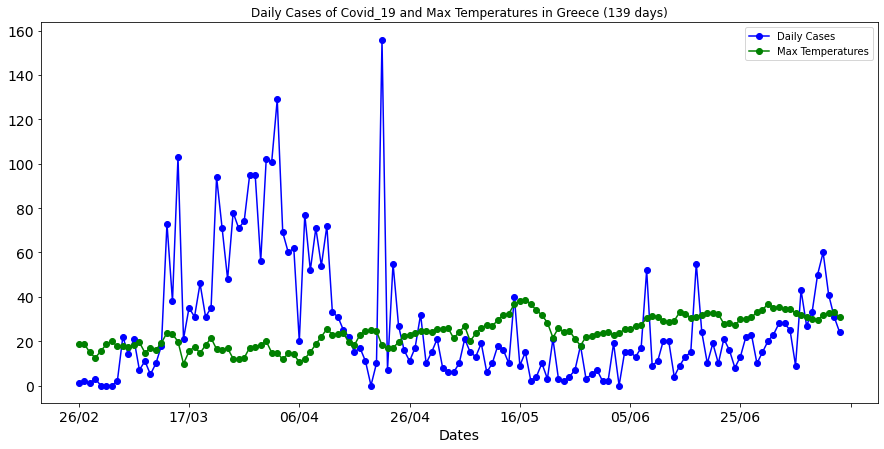

# Covid-19-Greece
Data and Plots about the pandemic progression. 

| Last Update | Total Cases | Days |
|     ---     |     ---     |  --- |
|  13-07-20   |     3826    |  139 |

  

## Main Idea
This project focuses on the virus Covid-19 in Greece by using the necessary data and the corresponding plots for better understanding of the progression of the pandemic in the country.

The main and most important file of the project is : *Covid-19_Data_Greece.ipynb*.

## A closer look on the file

We are focusing on three (3) basic datasets.

1. Data of the virus from the beggining until today.
2. New data from the official daily report by the Hellenic National Organization of Public Health (EODY).
3. Weather data about the max temperature from Acharnes Weather Station.

After the manipulation of the above data we create a dataframe containing the following columns :

1. Dates
2. Total Cases
3. Daily Cases
4. Total Recovered
5. Active Cases
6. Max Temperatures

For example the tail (last 5 rows) of the dataframe for the date **13/07/20** is:  
|       |     Dates   |	Total Cases |	Daily Cases | Total Recovered | Active Cases |  Max Temperatures | 
|  ---  |      ---    |     ---     |     ---    |       ---        |      ---     |         ---       |
|  134  |     09/6    |	   3672     |	    50     |	     1374     	|     2105     |         29.7      |
|  135  |	    10/6    |	   3732     |	    60     |	     1374       |	    2165     |         31.6      |
|  136  |	    11/6    |	   3772     |	    41     |	     1374       |	    2205     |         32.9      |
|  137  |     12/6    |	   3803     |	    31     |	     1374       |	    2236     |         33.0      |
|  138  |	    13/6    |	   3826     |	    24     |	     1374       |	    2259     |         30.9      |

Until **13/07/20** some of the plot using the above dataframe

Until **20/06/20** some of the plots of the data were :

## Total Cases per day

  

## Daily Cases

  

## Total Cases & Total Recovered

  

## Total & Active number of Cases

  

## Total & Daily Number of Cases

  

## Daily Cases & Max Temperatures per day

  

**Note:** To see the plots of an exact date, choose the corresponding folder from Plots_per_Date.

The sources been used to extract the data are : 
1. https://covid19.gov.gr/covid19-live-analytics/  
2. https://en.wikipedia.org/wiki/COVID-19_pandemic_in_Greece  
3. http://www.meteoacharnes.gr/statistika/datasummary.htm  

## Extras
Check also this svg map of the pandemic progression per region in Greece : https://codepen.io/KostasT/pen/PoPrLgK

  

## Author
* **Konstantinos Thanos**
