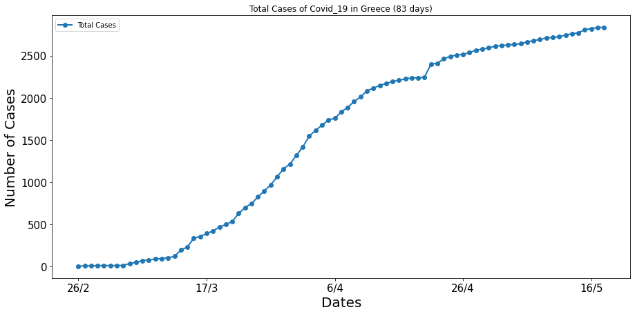
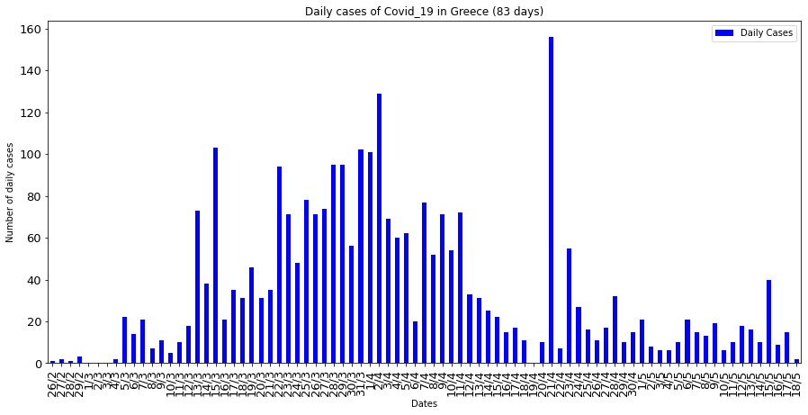
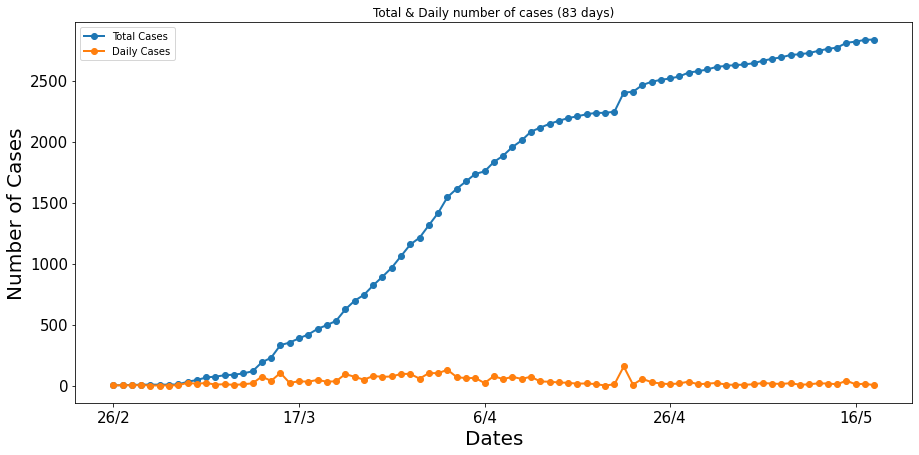
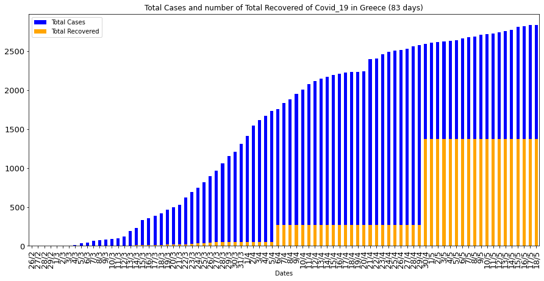
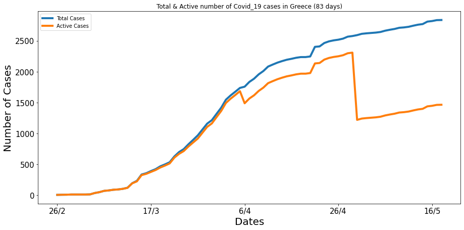
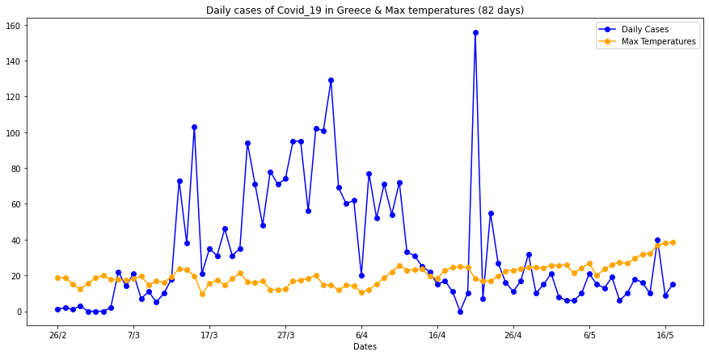

# Covid-19-Greece
Data and Plots about the pandemic progression. 
## Last Update : 30/05/20

  

The data comes from the local csv file : *covid-19_greece_data.csv*

In this project we load two dataframes from the above data-file. 
The first one contains informations about : 

1. Dates  
2. Number of Total Cases  
3. Number of Daily Cases  
4. Increase %  
5. Number of Total Recovered  
6. Number of Active Cases  

For example the tail (last 5 rows) of the first dataframe for the date 18/05/20 is:  
|       |     Dates   |	Total Cases |	Daily Cases |	Increase % | Total Recovered | Active Cases |  
|  ---  |      ---    |     ---     |     ---    |       ---       |      ---     |  --- |
|  78   |     14/5    |	   2770     |	    10     |	    0.36%      |	    1374   	| 1396 |  
|  79   |	    15/5    |	   2810     |	    40     |	    1.44%      |	    1374    |	1436 |  
|  80   |	    16/5    |	   2819     |	     9     |	    0.32%      |	    1374    |	1445 |  
|  81   |     17/5    |	   2834     |	    15     |	    0.53%      |	    1374    |	1460 |  
|  82   |	    18/5    |	   2836     |	     2     |	    0.07%      |	    1374    |	1462 |  

The second dataframe contains one extra column about :  

7. Max Temperatures per Day  

For example the tail (last 5 rows) of the second dataframe for the date 18/05/20 is:  
|       |     Dates   |	Total Cases |	Daily Cases |	Increase % | Total Recovered | Active Cases |  Max Temperatures |  
|  ---  |      ---    |     ---     |     ---    |       ---       |      ---     |  --- |   --- |  
|  77 	|     13/5    | 	 2760     |	    16     |     	0.58% 	   |      1374 	  | 1386 |	31.7 |  
|  78   |     14/5    |	   2770     |	    10     |	    0.36%      |	    1374   	| 1396 |  32.4 |  
|  79   |	    15/5    |	   2810     |	    40     |	    1.44%      |	    1374    |	1436 |  36.7 |  
|  80   |	    16/5    |	   2819     |	     9     |	    0.32%      |	    1374    |	1445 |  38.2 |  
|  81   |     17/5    |	   2834     |	    15     |	    0.53%      |	    1374    |	1460 |  38.7 |  

In the second dataframe we use data until yesterday (- 1 day) because the temperature data are not yet available.

Until **18/05/20** some of the plots of the data were :

  

  

  

  

  

  

**Note:** To see the plots of an exact date, choose the corresponding folder from Plots_per_Date.

The sources been used to extract the data are : 
1. https://covid19.gov.gr/covid19-live-analytics/  
2. https://en.wikipedia.org/wiki/COVID-19_pandemic_in_Greece  
3. http://www.meteoacharnes.gr/statistika/datasummary.htm  

## Author
* **Konstantinos Thanos**
