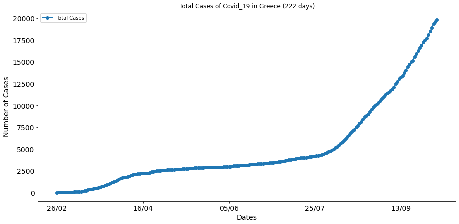
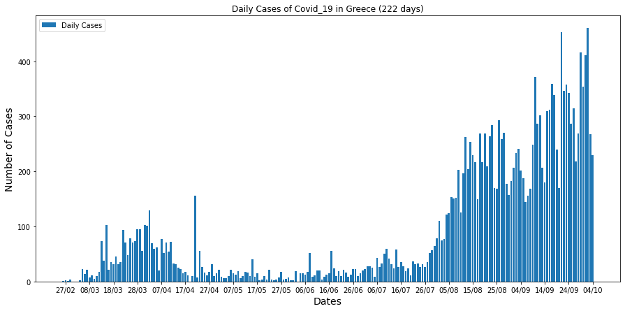
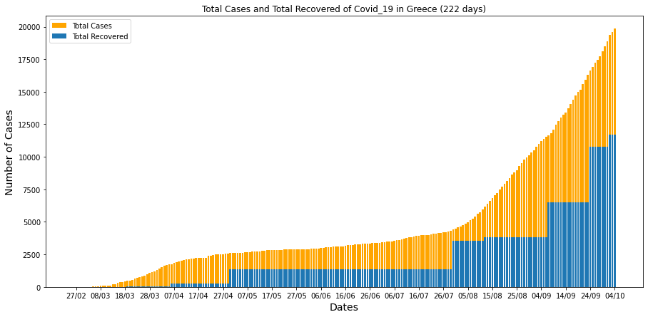
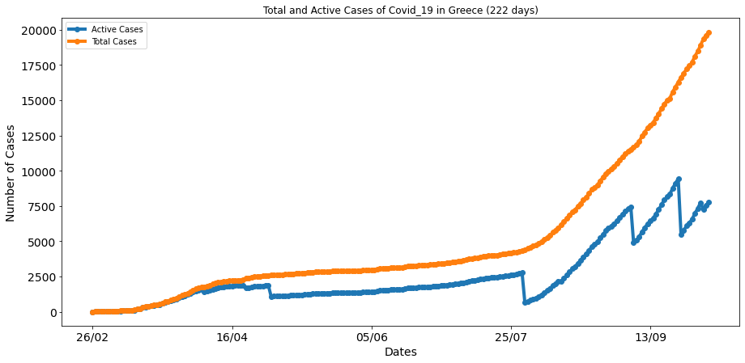
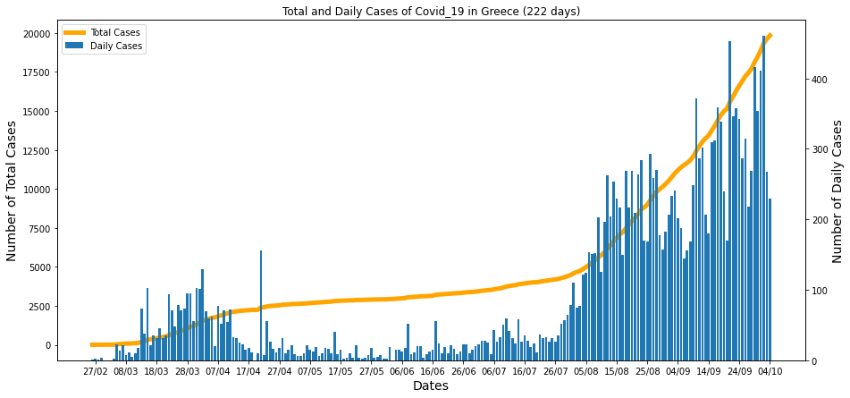

# Covid-19-Greece
Data and Plots about the pandemic progression in Greece. 

| Last Update | Total Cases | Days |
|     ---     |     ---     |  --- |
|  04-10-20   |    19842    |  222 |

  

## Main Idea
This project focuses on the virus Covid-19 in Greece by using the necessary data and the corresponding plots for better understanding of the progression of the pandemic in the country.

The main file of the project is : *Covid-19_Data_Greece.ipynb*.  

## A closer look on the file

We are focusing on three (3) basic datasets.

1. All the previous Covid-19 data from the beginning of the pandemic in the country.
2. New data from the official daily report by the Hellenic National Organization of Public Health (EODY).
3. Weather data about the max temperature from Acharnes Weather Station (**removed**).

After the manipulation of the above data we create a dataframe containing the following columns :

1. Dates
2. Total Cases
3. Daily Cases
4. Total Recovered
5. Active Cases

For example the tail (last 5 rows) of the dataframe for the date **04/10/20** were:  
|       |     Dates   |	Total Cases |	Daily Cases | Total Recovered | Active Cases | 
|  ---  |      ---    |     ---     |     ---    |       ---        |      ---     |
|  218  |    30/09    |   18475     |    354     |      10759       |      7325    |
|  219  |    01/10    |   18886     |    411     |      10759       |      7734    |
|  220  |    02/10    |   19346     |    460     |      11686       |      7262    |
|  221  |    03/10    |   19613     |    267     |      11686       |      7522    |
|  222  |    04/10    |   19842     |    229     |      11686       |      7747    |

and some of the plots until the same date (**04/10/20**) using the above dataframe were :
## Total Cases per day

  

## Daily Cases

  

## Total Cases & Total Recovered

  

## Total & Active Number of Cases

  

## Total & Daily Number of Cases

  

**Note:** To see the plots of an exact date, choose the corresponding folder from *Plots_per_Date*.
You can also see the above plots created with (plotly) in [Latest Plots of covid-19 in Greece](https://kostasthanos.github.io/svg_map_cases/Data_Plots/Categories/greek_plots.html).

## Check the jupyter notebook file
For a deeper understanding on how the data are being collected and used see the file *Covid-19_Data_Greece.ipynb* which contains all the necessary python comments describing each step of the project. 

Information about data extraction from the daily report are in the file [data_extraction.md](https://github.com/kostasthanos/Covid-19-Greece/blob/master/data_extraction.md)

The sources been used to extract the data are : 
**Covid19.gov.gr** : https://eody.gov.gr/category/covid-19/

**Note:** Max Temperature data has been deleted from the csv file.

## Check also 
For a more visual understanding of covid-19 cases in Greece per region the following page : 
[Covid-19 cases per region Greece](https://kostasthanos.github.io/svg_map_cases/regions_index.html)

## Author
* **Konstantinos Thanos**
