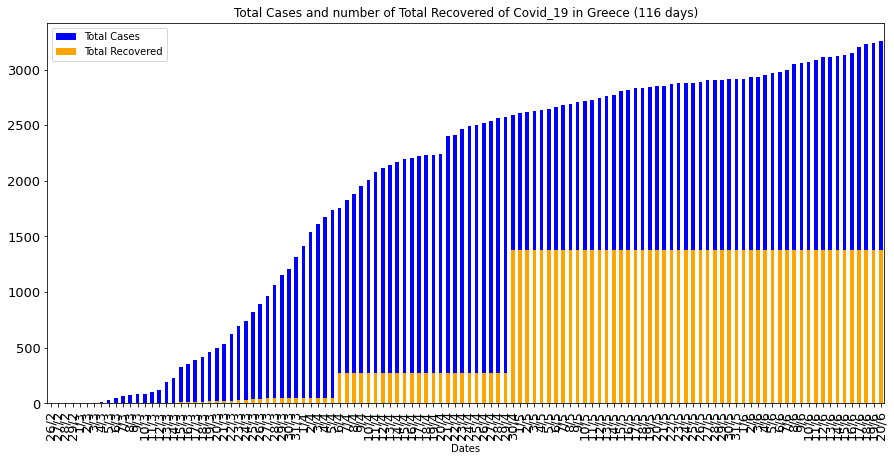

# Covid-19-Greece
Data and Plots about the pandemic progression. 

| Last Update | Total Cases | Days |
|     ---     |     ---     |  --- |
|  13-07-20   |     3826    |  139 |

  

This project focuses on the course of the virus Covid-19 in Greece by using the necessary data and the corresponding plots for better understanding of the progression of the pandemic.

1. Dates  
2. Number of Total Cases  
3. Number of Daily Cases  
4. Increase %  
5. Number of Total Recovered  
6. Number of Active Cases  

For example the tail (last 5 rows) of the first dataframe for the date **20/06/20** is:  
|       |     Dates   |	Total Cases |	Daily Cases |	Increase % | Total Recovered | Active Cases |  
|  ---  |      ---    |     ---     |     ---    |       ---       |      ---     |  --- |
|  111  |     16/6    |	   3148     |	    15     |	    0.45%      |	    1374   	| 1774 |  
|  112  |	    17/6    |	   3203     |	    55     |	    1.75%      |	    1374    |	1829 |  
|  113  |	    18/6    |	   3227     |	    24     |	    0.75%      |	    1374    |	1853 |  
|  114  |     19/6    |	   3237     |	    10     |	    0.31%      |	    1374    |	1863 |  
|  115  |	    20/6    |	   3256     |	    19     |	    0.59%      |	    1374    |	1882 |  

The second dataframe contains one extra column about :  

7. Max Temperatures per Day  

For example the tail (last 5 rows) of the second dataframe for the date **20/06/20** is:  
|       |     Dates   |	Total Cases |	Daily Cases |	Increase % | Total Recovered | Active Cases |  Max Temperatures |  
|  ---  |      ---    |     ---     |     ---    |       ---       |      ---     |  --- |   --- |  
|  110 	|     15/5    | 	 3134     |	    13     |     	0.42% 	   |      1374 	  | 1760 |	32.4 |  
|  111  |     16/5    |	   3148     |	    15     |	    0.45%      |	    1374   	| 1774 |  30.5 |  
|  112  |	    17/5    |	   3203     |	    55     |	    1.75%      |	    1374    |	1829 |  30.7 |  
|  113  |	    18/5    |	   3227     |	    24     |	    0.75%      |	    1374    |	1853 |  31.9 |  
|  114  |     19/5    |	   3237     |	    10     |	    0.31%      |	    1374    |	1863 |  32.8 |  

In the second dataframe we use data until yesterday (- 1 day) because the temperature data are not yet available.

Until **20/06/20** some of the plots of the data were :

  

  

  

  

  

  

**Note:** To see the plots of an exact date, choose the corresponding folder from Plots_per_Date.

The sources been used to extract the data are : 
1. https://covid19.gov.gr/covid19-live-analytics/  
2. https://en.wikipedia.org/wiki/COVID-19_pandemic_in_Greece  
3. http://www.meteoacharnes.gr/statistika/datasummary.htm  

## Extras
Check also this svg map of the pandemic progression per region in Greece : https://codepen.io/KostasT/pen/PoPrLgK

  

## Author
* **Konstantinos Thanos**
