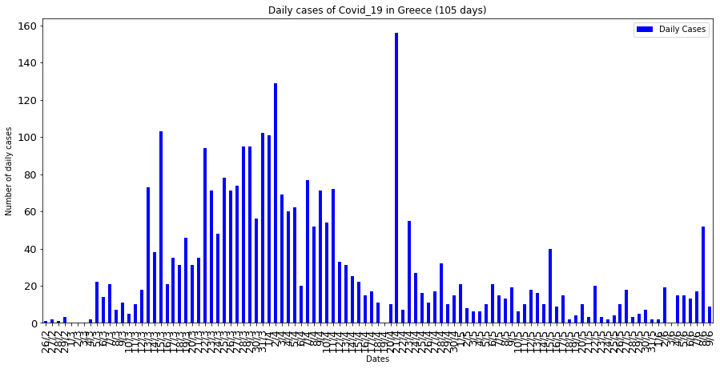

# Covid-19-Greece
Data and Plots about the pandemic progression. 
## Last Update : 09/06/20

  

The data comes from the local csv file : *covid-19_greece_data.csv*

**Important Informations**
|     |   Date   | Information |  
| --- |    ---   |     ---     |
|  1  | 29/03/20 | 1st case in Mount Athos |  
|  2  | 31/03/20 | 20 cases on a ship outside the port of Piraeus |  
|  3  | 02/04/20 | 23 cases in the Ritsona refugee and immigrant camp, 79 cases on the ship El. Venizelos |
|  4  | 21/04/20 | 150 cases in the refugee facility in Kranidi |
|  5  | 23/04/20 | 34 cases in a clinic in Peristeri |
|  6  | 04/05/20 | Removal of quarantine and use of a protective mask |
|  7  | 06/05/20 | 11 cases in the health structure 401 GSNA |
|  8  | 12/05/20 | 12 cases in facilities with vulnerable groups (2 in refugee camp in Lesvos) |
|  9  | 15/05/20 | 35 cases in Roma settlement in Larissa in Nea Smyrni, Larissa |
| 10  | 22/05/20 | 18 cases in Nea Smyrni, Larissa and 1 in the facility of Kranidi |
| 11  | 27/05/20 | 11 cases related to a known place and 2 related to repatriation repatriations |
| 12  | 31/05/20 | Both cases come from abroad |
| 13  | 02/06/20 | 12 cases related to flight arrival from abroad |
| 14  | 03/06/20 | There was no briefing on the progesss of the pandemic in country |
| 15  | 04/06/20-   08/06/20 | 30 travelers from abroad, and 29 in checks in Xanthi | 
 

In this project we load two dataframes from the above data-file. 
The first one contains informations about : 

1. Dates  
2. Number of Total Cases  
3. Number of Daily Cases  
4. Increase %  
5. Number of Total Recovered  
6. Number of Active Cases  

For example the tail (last 5 rows) of the first dataframe for the date 18/05/20 is:  
|       |     Dates   |	Total Cases |	Daily Cases |	Increase % | Total Recovered | Active Cases |  
|  ---  |      ---    |     ---     |     ---    |       ---       |      ---     |  --- |
|  78   |     14/5    |	   2770     |	    10     |	    0.36%      |	    1374   	| 1396 |  
|  79   |	    15/5    |	   2810     |	    40     |	    1.44%      |	    1374    |	1436 |  
|  80   |	    16/5    |	   2819     |	     9     |	    0.32%      |	    1374    |	1445 |  
|  81   |     17/5    |	   2834     |	    15     |	    0.53%      |	    1374    |	1460 |  
|  82   |	    18/5    |	   2836     |	     2     |	    0.07%      |	    1374    |	1462 |  

The second dataframe contains one extra column about :  

7. Max Temperatures per Day  

For example the tail (last 5 rows) of the second dataframe for the date 18/05/20 is:  
|       |     Dates   |	Total Cases |	Daily Cases |	Increase % | Total Recovered | Active Cases |  Max Temperatures |  
|  ---  |      ---    |     ---     |     ---    |       ---       |      ---     |  --- |   --- |  
|  77 	|     13/5    | 	 2760     |	    16     |     	0.58% 	   |      1374 	  | 1386 |	31.7 |  
|  78   |     14/5    |	   2770     |	    10     |	    0.36%      |	    1374   	| 1396 |  32.4 |  
|  79   |	    15/5    |	   2810     |	    40     |	    1.44%      |	    1374    |	1436 |  36.7 |  
|  80   |	    16/5    |	   2819     |	     9     |	    0.32%      |	    1374    |	1445 |  38.2 |  
|  81   |     17/5    |	   2834     |	    15     |	    0.53%      |	    1374    |	1460 |  38.7 |  

In the second dataframe we use data until yesterday (- 1 day) because the temperature data are not yet available.

Until **18/05/20** some of the plots of the data were :

  

  

  

  

  

  

**Note:** To see the plots of an exact date, choose the corresponding folder from Plots_per_Date.

The sources been used to extract the data are : 
1. https://covid19.gov.gr/covid19-live-analytics/  
2. https://en.wikipedia.org/wiki/COVID-19_pandemic_in_Greece  
3. http://www.meteoacharnes.gr/statistika/datasummary.htm  

## Extras
Check also this svg map of the pandemic progression per region in Greece : https://codepen.io/KostasT/pen/PoPrLgK

  

## Author
* **Konstantinos Thanos**
